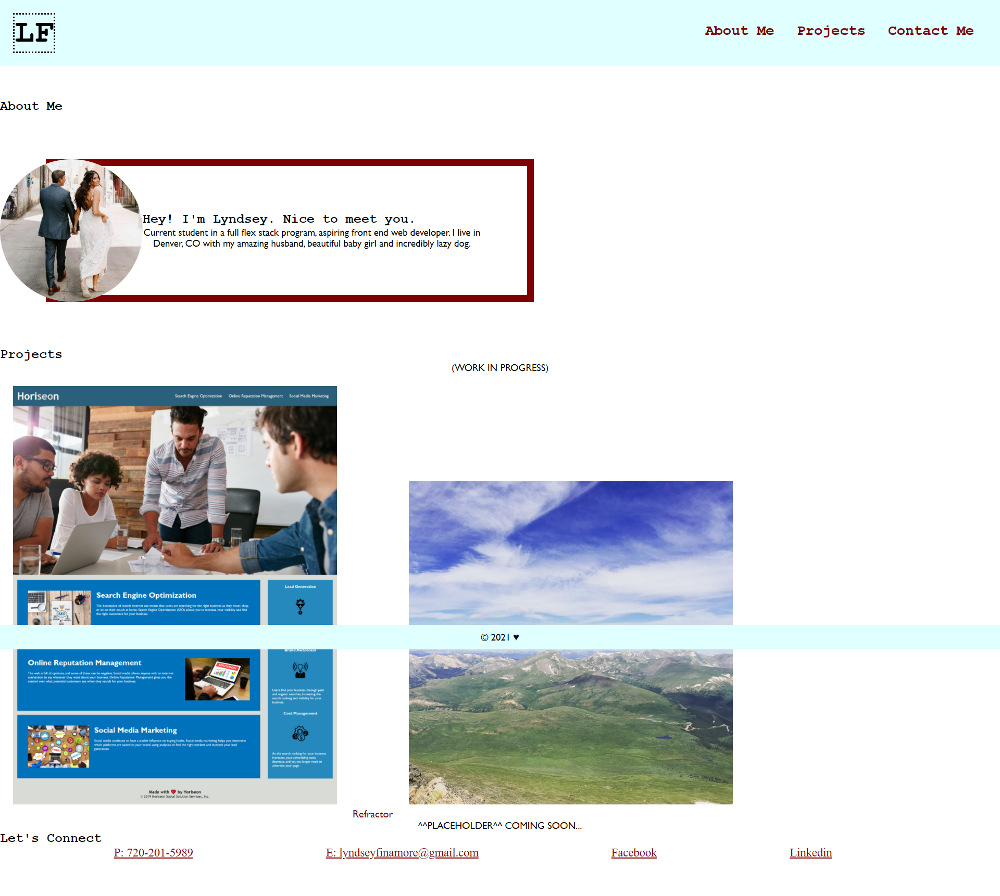

# 02-ADVANCED-CSS-PORTFOLIO
Second Assignment

## HTML
- I created this from the ground up using semantic HTML tags and personal work links + images
- I inserted a personal image of mine as a placeholder to be replaced with future projects

### CSS
- I styled my page the best I could! Very dificult for me and definitely a work in progress but I believe it all works accordingly

#### Link to deployed application
<a href="https://lyndseyfin.github.io/02-LYNDSEY-FINAMORE-PORTFOLIO/">Lyndsey Finamore Portfolio</a>

##### Screenshot
- Could not capture screenshot without footer in the middle for the life of me

